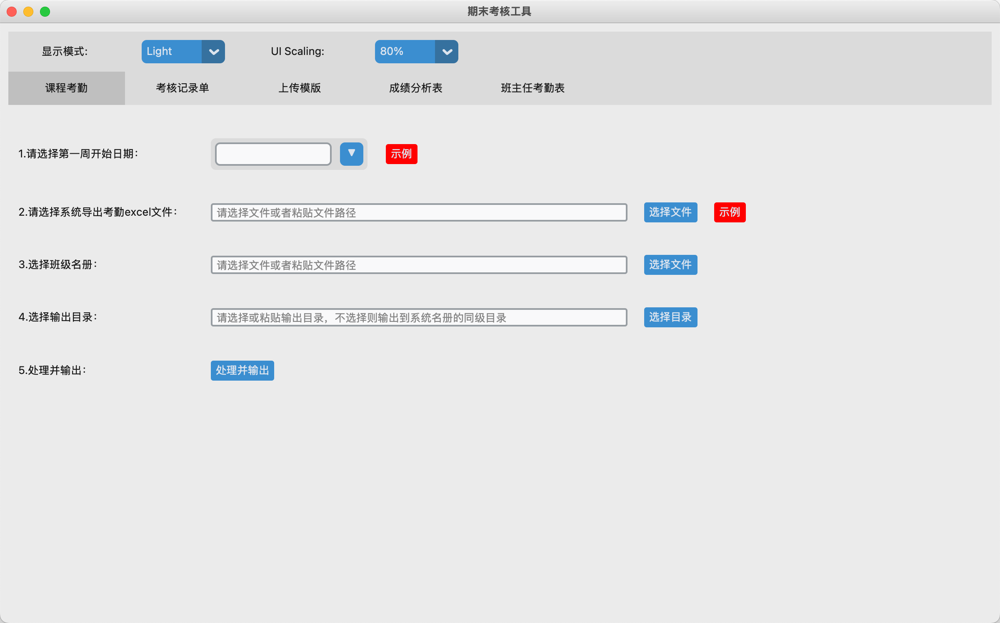
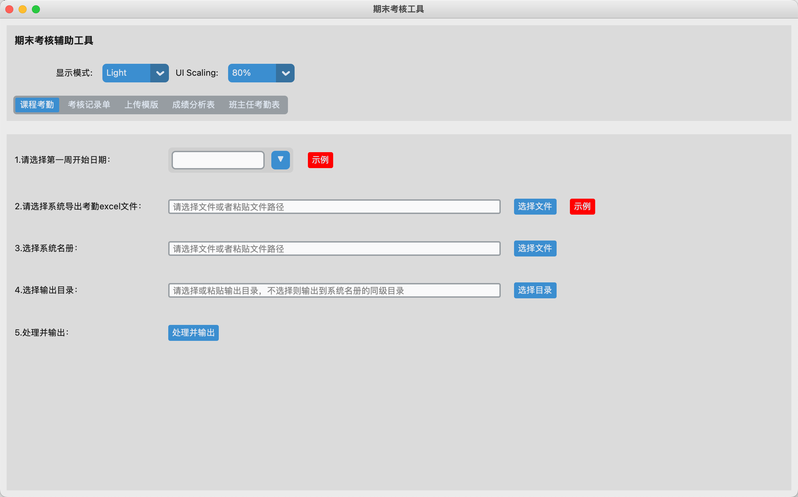
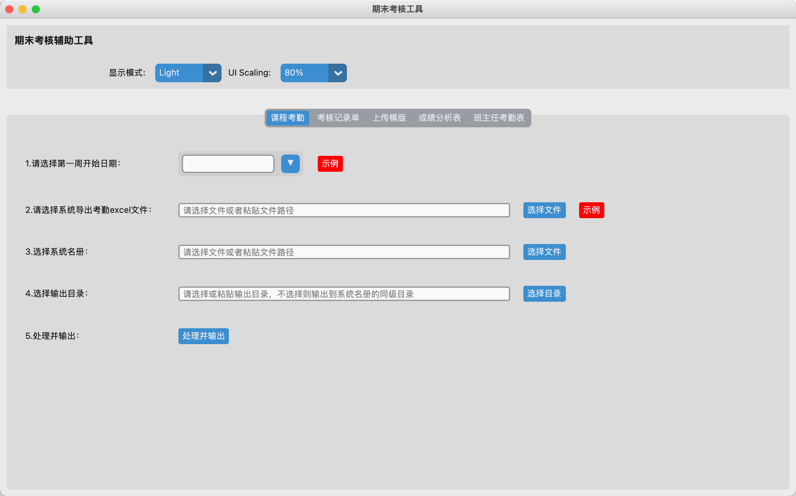

## 一个基于customtkinter实现的成绩处理辅助工具👋

我正在学习Python GUI，使用customtkinter制作了一个教师成绩辅助工具。

1、此程序可能不能用于你的工作，但是可以为你编写customtkinter程序提供一些帮助。

2、程序有三个界面，分别是Frame、CTkTabview、CTkSegmentedButton，都是实现一个功能，但是基于customtkinter 的Frame、CTkTabview、CTkSegmentedButton控件来实现的页面切换。启动他们只需要运行相应的 py 文件即可。

3、程序中调用了其他开发者的模块，感谢他们！

包括：customtkinter：https://github.com/TomSchimansky/CustomTkinter/tree/master

CTkDatePicke：https://github.com/maxverwiebe/CTkDatePicker?tab=readme-ov-file

moreCustomTkinterWidgets：https://github.com/fastattackv/MoreCustomTkinterWidgets

4、界面如下图所示：
    （1）Frame实现分页
    
    （2）CTkSegmentedButton实现分页
    
    （3）CTkTabview实现分页
    

由于 button中的command中的事件只能调用函数，而不能给函数传参，所以有很多选择文件和目录的函数，冗余量很大，如果你有好的方法，可以在issue中教我，谢谢你！

使用 auto-py-to-exe 打包的注意事项！

